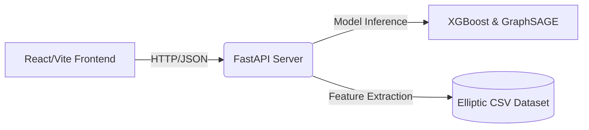

# CryptoTrace - Architecture Analysis

## 1. System Overview
The CryptoTrace application utilizes a disconnected microservice architecture designed to handle large-scale forensic cryptocurrency analyses natively over a React frontend, powered structurally through a high-performance Python ML engine.

## 2. Infrastructure Flow

### Components:
#### 2.1 Backend (Python API & ML Engine)
*   **FastAPI**: Operates synchronously loaded, statically mapped datasets inside `data_loader.py`, delivering ultra-fast read responses to the dashboard.
*   **XGBoost Tree Explainer**: Utilizes `class_weight` balancing and time-slice distributions to score transactions safely against unbalanced historical arrays, integrated tightly with `SHAP` libraries to provide feature weighting (like velocity and peeling chain probability) straight to the investigator.
*   **PyTorch (Stretch)**: Extends native tabular heuristics by deploying GraphSAGE, passing entire graph node histories to calculate holistic criminal network intersections.

#### 2.2 Frontend (React Application)
*   **React Router**: Dictates the View states spanning `Dashboard`, `Investigation`, and `GraphAnalysis`.
*   **State Control**: Utilizes robust Context/Effects to monitor target Entities and URL queries, passing string lookups straight to the Python backend endpoints.
*   **Visualization**: Employs `react-force-graph-2d` spanning targeted 200+ node subgraph limits (guaranteeing 60FPS fluid canvas interactions on modern hardware).

## 3. Data Ingestion Lifecycle
1.  **Boot Strapping**: `main.py` triggers `data_loader.py` immediately on execution.
2.  **Dataset Pre-caching**: 689MB feature arrays are loaded into active DataFrame state alongside Edgelist references.
3.  **Client Fetch**: The React frontend periodically calls `/api/alerts` to mount active high-risk arrays.
4.  **Live Investigation**: Investigators query `/investigate` triggering on-the-fly SHAP recalculations via `predictor.py`.
